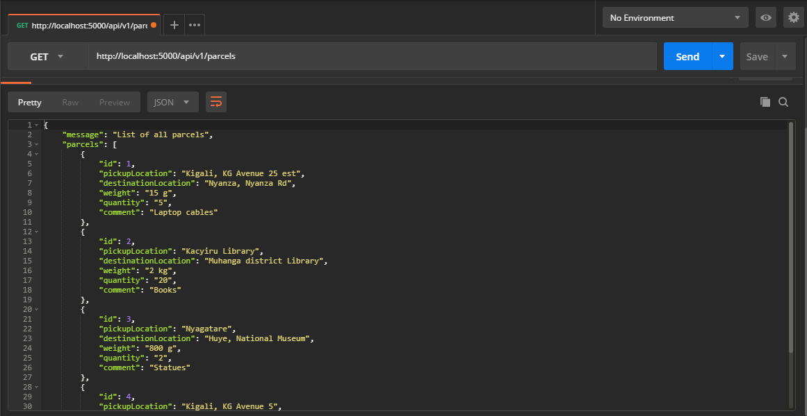
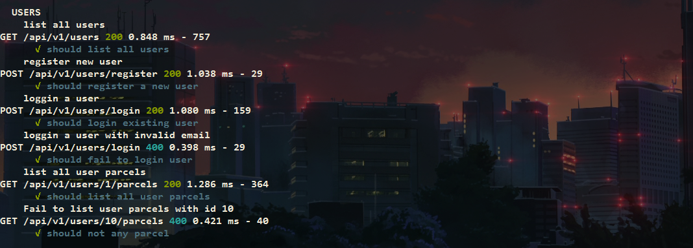
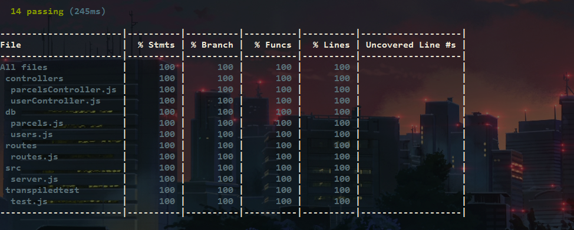

# SENDITAPI   

SendIT is a courier service that helps users deliver parcels to different destinations. SendIT provides courier quotes based on weight categories.

## Tasks:

- [x] Create Server Folder
  - [x] npm Init
  - [x] Add express eslint babel body-parser
- [x] Create a db file (with data structures schema)
- [x] List all parcels with GET /api/v1/parcels
  - [x] Create route
- [x] Setup tests
  - [x] Install mocha and chai
  - [x] Add npm test script
- [x] Make sure the tests are working!
- [x] GET route to list all parcels (/api/v1/parcels)
  - [x] Add test
- [x] GET route to list one parcel by id (/api/v1/parcels/:parcelId )
  - [ ] Validate id
  - [x] Create route
  - [ ] Add test
- [x] POST route to add a new parcel (/api/v1/parcels)
  - [x] Create route
  - [ ] Validate parcel
  - [ ] Add test
- [x] PUT route to cancel a specific parcel by id(/api/v1/:parcelId/cancel)
  - [ ] Create route
  - [ ] Validate id
  - [ ] Validate updates
  - [ ] Add test
- [x] Delete a record with DELETE /api/v1/parcels/:parcelId

  - [x] Create route
  - [ ] Validate id
  - [ ] Add test

- [ ] Travic ci
  - [ ] set up

* [ ] Deploy!

## Technologies that will be used for api:

- Server-side Framework: ​Node/Express
- Linting Library: ​ESLint
- Style Guide: ​Airbnb
- Testing Framework: ​Mocha ​​ or ​ Jasmine

## preview inside postman

### all parcels

### passed all users tests

### nyc coverage reports: to work with travis

