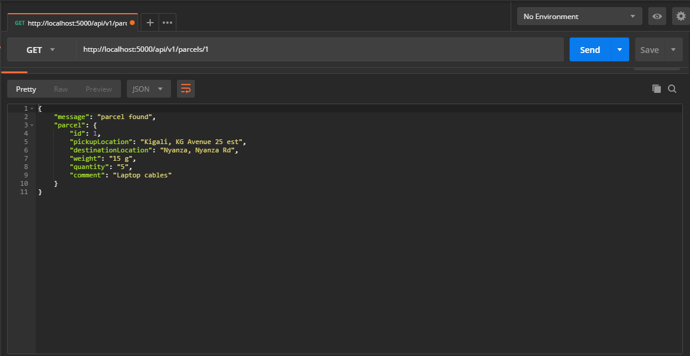
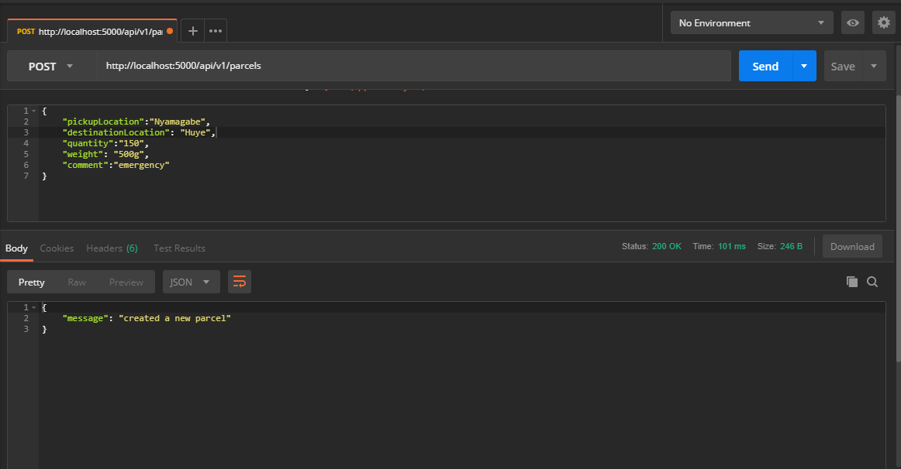
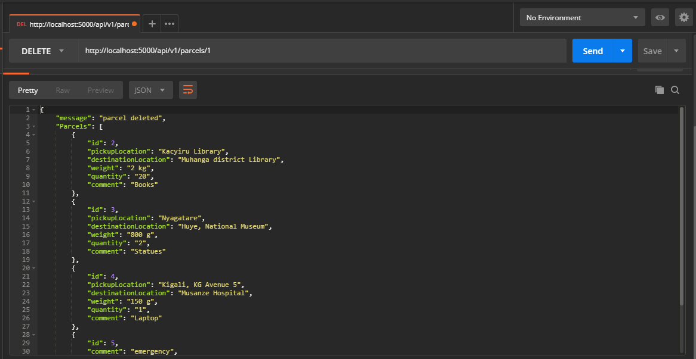

# SENDIT Api

SendIT is a courier service that helps users deliver parcels to different destinations. SendIT provides courier quotes based on weight categories.

## Tasks:

- [ ] Create Server Folder
  - [ ] npm Init
  - [ ] Add express eslint babel body-parser
- [ ] Create a db file (with data structures schema)
- [ ] List all parcels with GET /api/v1/parcels
  - [ ] Create route
- [ ] Setup tests
  - [ ] Install mocha and chai
  - [ ] Add npm test script
- [ ] Make sure the tests are working!
- [ ] GET route to list all parcels (/api/v1/parcels)
  - [ ] Add test
- [ ] GET route to list one parcel by id (/api/v1/parcels/:parcelId )
  - [ ] Validate id
  - [ ] Create route
  - [ ] Add test
- [ ] POST route to add a new parcel (/api/v1/parcels)
  - [ ] Create route
  - [ ] Validate parcel
  - [ ] Add test
- [ ] PUT route to cancel a specific parcel by id(/api/v1/:parcelId/cancel)
  - [ ] Create route
  - [ ] Validate id
  - [ ] Validate updates
  - [ ] Add test
- [ ] Delete a record with DELETE /api/v1/parcels/:parcelId
  - [ ] Create route
  - [ ] Validate id
  - [ ] Add test

* [ ] Deploy!

## Technologies that will be used for api:

- Server-side Framework: ​Node/Express
- Linting Library: ​ESLint
- Style Guide: ​Airbnb
- Testing Framework: ​Mocha ​​ or ​ Jasmine

## preview inside postman

### all parcels

### one parcel

### create a parcel

### delete a parcel

